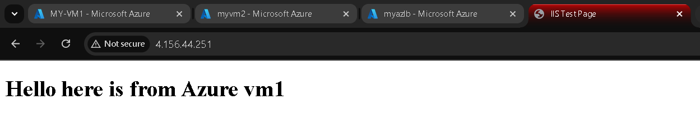

# MULTI-CLOUD-ARCHITECTURE

**COMPANY**: CODTECH IT SOLUTIONS 

**NAME**: M.S.G.N. SURYA VAIBHAV

**INTERN ID**: CT08IVH

**DOMAIN**: CLOUD COMPUTING

**BATCH DURATION**: JANUARY 20, 2025 to FEBRURAY 20, 2025

**MENTOR NAME**: NEELA SANTOSH

## TASK: 

- DESIGN A MULTI-CLOUD ARCHITECTURE WHERE SERVICES ARE DISTRIBUTED ACROSS TWO CLOUD PROVIDER 
- DELIVERABLE: A DOCUMENTATION AND DEMO SHOWCASING INTEROPERABILITY BETWEEN THE PLATFORMS

## Tools used :
               1. Amazon Route 53
               2. AWS Virtual private cloud 
               3. Amazon EC2
               4. AWS Elastic load balancer (application)
               5. Target Groups
               6. Azure Load balancer
               7. Virtual machine
               8. Azure virtual network 

## Architecture :
  
## Description :     

- <ins> ***Amazon Route 53*** </ins> :  That's right! Route 53 is AWS's highly available and scalable DNS web service. In the diagram, it's represented by the icon in the top center, managing traffic flow between the primary and secondary regions.  The "Route 53 Routing Controls" suggest the use of features like traffic policies or health checks to direct traffic.

- <ins> ***AWS Virtual Private Cloud (VPC)*** </ins> : Absolutely! The green box labeled "Virtual Private Cloud" on the right of the diagram represents an AWS VPC.  It's a logically isolated section of the AWS Cloud where you can launch AWS resources in a virtual network that you define.

- <ins> ***Amazon EC2 (Elastic Compute Cloud)*** </ins> :  Correct. The orange boxes labeled "Amazon EC2" within the AWS VPC represent EC2 instances. These are virtual servers in the AWS cloud.   

- <ins> ***AWS Elastic Load Balancer (Application)*** </ins>:  Spot on! The purple icon labeled "Application Load Balancer" distributes incoming application traffic across multiple EC2 instances (or other targets) in order to increase the availability and scalability of the application.

- <ins> ***Target Groups*** </ins> :  These aren't directly visible in the diagram. Target groups are used with load balancers to define sets of targets, such as EC2 instances, that will receive traffic. While essential for load balancing, they are a configuration concept rather than a distinct visual element in this diagram.

- <ins> ***Azure Load Balancer*** </ins> :  Correct. The icon labeled "Azure (automatic) Load Balance" on the left of the diagram performs a similar function to the AWS Application Load Balancer, distributing traffic to virtual machines within the Azure Virtual Network.

- <ins> ***Virtual Machine*** </ins> :  Right. The blue boxes labeled "Virtual Machine" within the Azure Virtual Network represent virtual servers running in the Azure cloud.

- <ins> ***Azure Virtual Network*** </ins> :  Correct. The light blue box labeled "Virtual Network" represents an Azure Virtual Network. It's a logical isolation of the Azure cloud, similar to an AWS VPC, allowing you to define your own private network space.

## Procedure :
### AWS region setup :
### **EC2:-**
- First go to ec2
- launch and instance -> give an name to the instance
- i am taking the amazon linux ami here
- instance type t2.micro
- select or create an keypair
- make network setting i am doing the default vpc settings and creating the security group and allow the HTTP traffic
- configure the basic storage settings of 8 gib of gp3
- go to advance details and then scrool to the user data
- enter this script there [userdata](aws_user_data.sh)
- Launch the instance
- now launch another instance with the same steps and change the user data ~~hello i am from vm1~~ to Hello i am from vm2
- launch this instance 
### **Elastic load balancer:-**
- Go to load balancing -> load balancers
- create an load balancer -> Application Load Balancer
-  Give an name to this load balancer -> internet facing
-  loadbalancer ip type IPv4
-  network mapping -> default vc and select all avaliblty zones that you have deployed ec2
-  click on create an new security group and then give an name to the security group
-  inside the inbound rules add an rule that type is **HTTP** and source type is **Anywere IPv4** add the rule
-  create the security group & add the security group to LB and remove the default security group
-  listners **create an target group**
-  instances -> name -> IPv4 -> HTTP -> health checks HTTP
-  select the instances that you want to load balance in **port - 80**
-  create target group
-  select the target group there and then create the load balancer
-  Go to the created load balancer and we have the dns link or the ip assoiated with it copy the ip and paste it in the browser
-  Then it should show the output of either the load was going to load balancer 1 or 2 like given below
  
  

### Azure region setup :
### **Virtual machine :-**
- create an virtual machine -> create an resourse group -> give an name to the virtual machine
- select the region for the virtual machine -> select the avaiblity zone for the vm
- security type - standard -> select the AMI type and the version of the AMI -> vm architecture of x64
- size standard -> create an username and an password to the vm
- inbound rules select the http and the ssh (for windows connection)
- go to networking and select the virtual networks and also allow the http in inbound rules
- then review and create -> create the virtual machine
- create another virtual machine of same configurations and also make shure that the both vm's are in sam vnet
- Then go to the vm and in the the vm goto the run command script tab and click run
- Give the vm an run command script to run [script](azure-command.ps1)
- same way goto the vm2 and change the script and run the script
### **Application load balancer:-**
- search for the load balancer -> create -> create the resouce group -> enter the name for the lb
- select the region which will same as your vm's
- add an frontend ip -> name -> IPv4 -> ip address -> create new ip address -> add
- backend pool -> name the backend pool -> select vn -> NIC -> add and add both the vm's ->save
- inbound rules -> add an inbound rule -> give the name
- ipv4 -> select the front ip and the backend pool created -> TCP -> port's -80,80 -> save
- review and create
- there would be an ip address given copy the address and paste in the browser
- you should see which vm the load is going
  
  

### **AMAZON Route 53 :-**
- go to aws and search route53
- create an hosted zone -> enter your domain name -> public hosted zone create the hosted zone
- Copy the NS records of route 53 and put the records in your domain records (godaddy for me)
- manage dns edit name server records -> enter all the name server records
- create 2 A records which are also host records
- create a record -> record type -A
- alias-yes -> alias to application load balancer -> zone that host the load balancer
- select the failover ->  failover record as primary-> record id = 1
- add another record -> record type - A -> type the public ip of azure load balancer
- failover ->  secondary -> record id = 2
- create record

## ***output:-***
- When the domain name is accessed, the output that appears at first is the same as that of the AWS load balancer: **Hello, I'm from VM 1/2**. This is due to the fact that Route 53 is set up to give the AWS region priority as the main traffic target.  Until a failure condition is identified, traffic will keep going to AWS. Traffic will be redirected to Azure in the event of an AWS failure because of the defined failover parameters 
- The AWS EC2 instances can be stopped for testing. Following a 5–15 second failover, traffic will be routed to the Azure virtual computers.  After that, **hello from Azure VM1/2** will appear in the output. This illustrates the mechanism of failover
